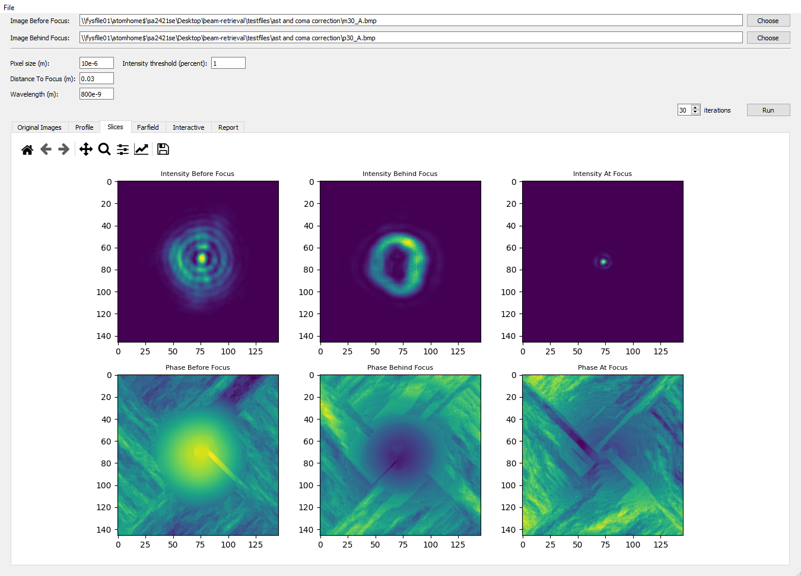

# About

Implements a modified version of the Galton-Saxton iteration technique to retrieve the phase of a beam, using two planes at approximately equal distance from the focus. Created for the laser lab at the Department of Physics at Lund University, using the beam propagation toolbox Light Pipes: https://opticspy.github.io/lightpipes/


# Structure

* **field_retrieval.py** - Functions responsible for retrieving the phase of the beam.
* **field_analysis.py** - Calculates metrics of the retrieved beam at different planes, such as Strehl ratio and x/y-spread.
* **visualizations.py** - Creates isualizations of the field and generated metrics.
* **gui.py** - Main GUI.
# Installation 

```sh
pip install LightPipes numpy matplotlib PyQt5
```

* Run beam_retrieval/gui.py

# Create executable

Download pyinstaller and run

```sh
pyinstaller beam_retrieval/gui.py -y --noconsole --add-data="mainwindow.ui;."
```

in the root folder.
